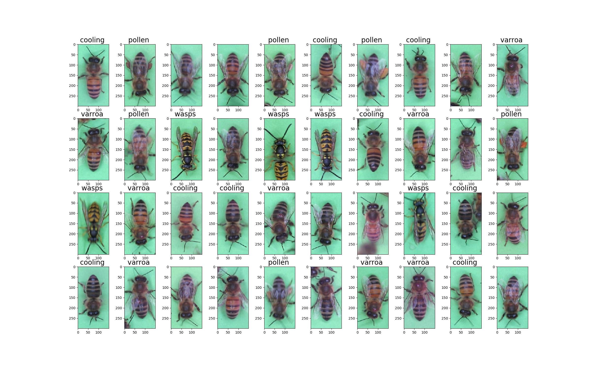

# BeeDataset &#128029;

Tensorflow dataset containing images of bees for multilabel classification

This dataset contains ~7.500 images of bees, captured at the entrance of a bee hive. Each image contains one bee, rotated to a vertical format, heads or tails up. This dataset was created for a masters thesis on detecting characteristics of bees and parasites like the varroa mite.

It is also part of the tensorflow dataset: <a href="https://www.tensorflow.org/datasets/catalog/bee_dataset">https://www.tensorflow.org/datasets/catalog/bee_dataset</a>

All images have multiple labels, such as:

- **cooling_output**  - Indicating that the bee is currently cooling the hive. The bee is flapping its wings while keeping its position stationary, that way it transports fresh air into the hive.
- **pollen_output** - Indicates that the bee carries a pollen packet
- **varroa_output** - Indicates that the bee is infested with the varroa mite. The varroa mite is a small circular pest which is 1-2mm in diameter and of brown color. The mite will be carried into the hive, where it seriously damages the bee larva. If left untreated, the whole colony dies.
- **wasps_output** - Instead of a bee, a wasp was captured.

## Have fun!
